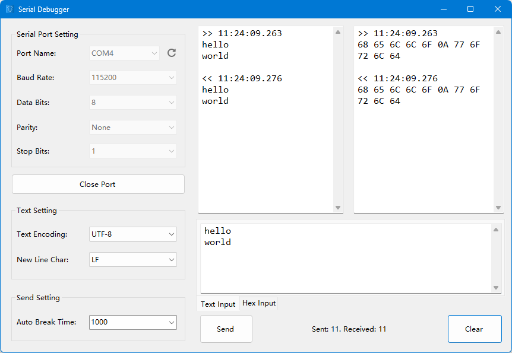

# Serial Debugger

A lightweight Windows application for debugging serial port communication. Send and receive data over a serial port in either text or hex format, with timestamps and persistent settings.



## Features

- Open/close any available COM port with one click
- Configurable baud rate, data bits, parity, stop bits, encoding, and newline
- Dual input modes — type plain text or paste raw hex (with or without spaces); the two views stay in sync
- Dual display panes showing sent (`>>`) and received (`<<`) data side-by-side in both text and hex, timestamped to the millisecond
- Auto-break grouping: bursts arriving within the configured interval are concatenated for readability
- Non-blocking send/receive on background threads with thread-safe UI updates
- Live `SentCount` / `ReceivedCount` status
- Settings auto-persist to `%AppData%\SerialDebugger\settings.json` and reload on next launch
- Hot-unplug detection — closes the port and notifies you if the device is removed while open

## Requirements

- Windows 10 / 11

## Download Release

The compiled binary can be downloaded from [Github](https://github.com/michaelliao/serial-debugger/releases/latest).

## Build from Source

```powershell
git clone https://github.com/michaelliao/serial-debugger.git
cd serial-debugger
dotnet build -c Release
```

The compiled binary is placed under `bin\Release\net10.0-windows\`.

To run from source:

```powershell
dotnet run
```

## Usage

1. Launch `SerialDebugger.exe`.
2. Pick a port from the dropdown (click **Refresh** if your device was plugged in after launch).
3. Set baud rate, data bits, parity, stop bits, encoding, and newline as needed.
4. Click **Open Port**.
5. Type into the text box, or paste a hex string like `48 65 6C 6C 6F` (whitespace is optional) into the hex box, then click **Send**.
6. Sent and received frames appear in their respective display panes with timestamps.

### Hex input rules

| Input                | Bytes                                    |
|----------------------|------------------------------------------|
| `48 65 6C 6C 6F`     | `48 65 6C 6C 6F`                         |
| `48656C6C6F`         | `48 65 6C 6C 6F`                         |
| `48656C6C6`          | `48 65 6C 6C 06` (trailing nibble = low) |
| `48656 C6C6F`        | `48 65 06 C6 C6 0F` (whitespace splits)  |

## Settings

User settings live at `%AppData%\SerialDebugger\settings.json`. They are validated on load — invalid values fall back to defaults and the file is rewritten.

| Key            | Default   | Notes                          |
|----------------|-----------|--------------------------------|
| `baudRate`     | `115200`  | 1200 – 921600                  |
| `dataBits`     | `8`       | 7 or 8                         |
| `parity`       | `None`    | None / Even / Odd / Mark       |
| `stopBits`     | `1`       | 1 / 1.5 / 2                    |
| `textEncoding` | `UTF-8`   | UTF-8 / ASCII / …              |
| `newLine`      | `LF`      | CR / LF / CRLF                 |
| `autoBreak`    | `1000`    | 0 – 10000 ms grouping interval |

## License

Released under the [GNU GPL v3](LICENSE).
